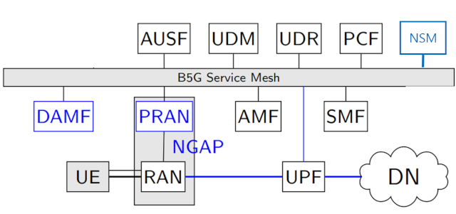
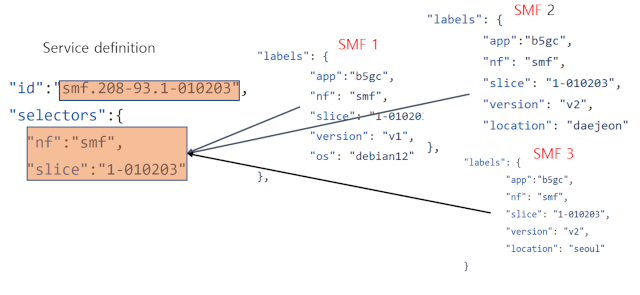

## Architectural Enhancements

ETRI's core network adheres to the 3GPP architecture with some customized extensions:



### Native Service Mesh

We replace the traditional service registration and discovery with our own service mesh to ease cloud deployment and support multi-cloud environments. The service mesh comprises a control plane and multiple agents:

- **Agents**: Embedded libraries within network functions (NFs) that manage service registration and discovery.
- **Control Plane**: Functions similarly to an NRF, acting as a central registry tightly integrated with the Kubernetes control plane. It includes:
  - A **controller** serving as the global registry.
  - **Gateways** that serve as local registries and Layer 7 proxies for inter-cluster NF communication.

### AMF Decomposition

The Access and Mobility Function (AMF) is split into three components:

- **PRAN (Proxy RAN)**: Handles NGAP messages from the RAN and translates them into RESTful requests for the core.
- **DAMF (Default AMF)**: Manages initial authentication and assigns UEs to AMFs.
- **AMF**: Does not perform default AMF functions and communicates with PRAN via a service-based interface. This design decouples NGAP from AMF, enabling better scalability.

### Service-Based Interface for N4

The SMF-UPF interface has been replaced with RESTful APIs. UPFs register directly with the service mesh, and SMFs dynamically discover UPF topologies, supporting automated scaling.

### Centralized Configuration Management

A new function, **Network Slice Manager (NSM)**, manages AMF identities and system-wide configurations.

## Notes

### Implementation

All components are developed from scratch, except UPF which uses components from the `free5gc` project for `gtp5g kernel` module communication.

We developed custom protocol encoding libraries for NAS, NGAP, and PFCP with user-friendly APIs and enhanced performance, avoiding Go's `reflect` package.

### Service discovery

Service discovery in ETRI's core follow common approach in micro-service architecture which is simple comparing to the design of 3gpp architecture. Service is enforced to has an unique identity and an instance offering the service can be discovered through that identity (with optional parameters for advance traffic routing). An deployed NF instance is described with labels (which is a list of key-value pairs). The service mesh define the service and how to map it to its running instances.



### AMF scaling

When an UE re-attaches to the network, the core need to search for the last AMF instance that served the UE. The search is based on the AMF id which is part of the UE's GUTI which was assigned to its during the last attachment. With stateful AMF, scaling is not possible if AMFs in a replica set sharing the same AMF id.

To support automated AMF scaling we introduce the concept of AMF set that  represents a replica set of AMFs. A set has an identity which is composed of AMF region and AMF set (Recall that an 3GPP's AMF id = AMF region + AMF set + AMF pointer). Scaling is therefore based on the set identity. AMFs in a replica set are sharing the AMF region part and AMF set part in their AMF identities. The AMF pointer part is allocated by the NSM dynamically. By that, each AMF will have a unique 3GPP's AMF identity. 


## Deployment

### Building the system

Building should be simple. Just clone the repo then:

```bash
make all
```

Binary applications should be available under the `project-root/bin` folder.


### Order of NF deployment
The deployment should follow this order:

 - Controller + service definitions
 - Gateways
 - NSM (for hosting all system configuration and allocating resources to SMFs/AMFs)
 - Other NFs and a mongo-db (UDR) in any order
 


### Sytem-wide configuration

All configuration files for the system can be found under `config` folder.

NSM holds the system-wide configuration (see `nsm.json`). When a network instance goes online, it may request its partial configuration from the NSM. That's why we must have one instance of NSM and bind it to NSM service identity so that other NFs can find it to pull their configuration.

### Data network definition

```json
"dataNetworks": [
		{
			"name": "internet",
			"cidr": "10.60.0.0/16",
			"numIpPools": 50
		},
		{
			"name": "etri",
			"cidr": "129.254.195.0/24",
			"dhcpServer": "129.254.195.100"
		}
	]
```

Each item in the defined list is the configuration of a data network in the system.
A data network should have an identity (`name`) and its IP domain (`cidr`).
SMFs need to pull these configuration so that it will know how to allocate IP addresses for a PDU session of a certain data network. There are two method for SMF to allocate an IP address:

 - request an external DHCP server (not supported yet)
 - SMF is assigned an IP pool which is a range of IP address in the defined CIDR. It then allocate an IP from this pool. In case of SMF scaling (multiple SMF serving the same data network), the NSM will assign the SMF with an IP pool. The parameter `numIpPools` specifies the number of IP pools that the NSM can assign. Therefore, the number of SMFs serving a data network should not larger than this number.


#### Slice definition

```json
"slices": [
		{
			"id":{
				"sd":"010203",
				"sst":1
			},
			"dataNetworks":["internet"]
		},
		{
			"id":{
				"sd":"543210",
				"sst":1
			},
			"dataNetworks":["internet"]
		}
	]
```

Each slice can server multiple data networks. Data network names should be defined in the previous part. Both fields (`st` and `sst`) of a slice identification must not empty.

### Slice selection configuration

This part is all about assigning AMFs to slices. A single AMF instance can belong to a replica set identified with an AMFSet identity (AMF region + AMF set). A set can serve multiple slices. When UE first attaches to the network it is assigned with a list of slices (either from its request, its subscription data or default configuration from the core). The core looks into this configuration to select an AMF set that can handle the set of UE's assigned slices then pick one instance in the set to serve the UE.


```json
"amfSets":[
		{
			"setId":"10-100",
				"slices": [
					{
						"sd":"010203",
						"sst":1
					},{
						"sd":"543210",
						"sst":1
					}]
		},{
			"setId":"10-101",
				"slices": [
					{
						"sd":"010203",
						"sst":1
					}]
		},{
			"setId":"10-102",
				"slices": [
					{
						"sd":"010203",
						"sst":1
					}]
		}
	]
```

### UDR configuration

In ETRI's core, a mongdb is used in placement of the UDR for simplicity. PCF and SMF can query the database directly without using the UDR's APIs.

```json
"udr": {
		"url": "mongodb://192.168.0.9:27017",
	  	"dbName": "etrib5gc",
	  	"authSub": "authsub",
	  	"amSub": "amsub",
	  	"smfSel": "smfSel",
	  	"smSub": "smSub",
	}
```

Pay attention to the `url` of the data base. You must set it correctly to the address of your mong-db deployment.


### SUCI relate configuration

These settings are used at UDM for ``SUCI` recovery. When creating UE subscription data and UE profile for UERANSIM, the same settings must be used.

```json
"suciProfiles":[
		{
			"protectionScheme": 1,
			"privateKey":       "c53c22208b61860b06c62e5406a7b330c2b577aa5558981510d128247d38bd1d",
			"publicKey":        "5a8d38864820197c3394b92613b20b91633cbd897119273bf8e4a6f4eec0a650"
	  	},
	  	{
			"protectionScheme": 2,
			"privateKey":       "F1AB1074477EBCC7F554EA1C5FC368B1616730155E0041AC447D6301975FECDA",
			"publicKey":        "0472DA71976234CE833A6907425867B82E074D44EF907DFB4B3E21C1C2256EBCD15A7DED52FCBB097A4ED250E036C7B9C8C7004C4EEDC4F068CD7BF8D3F900E3B4"
	  	}
	]
```

 
### Controller:
Nothing to configure, just run it.
The controller listens to port 8888,you can change the port in the configure file:
```json
{
	"bind":"",
	"port": 8888
}
```


### Gateway:

```json
{
	"registeredAddr": "",
	"bind": ":7777",
	"controller": "192.168.0.6:8888",
	"labels": {
		"loc": "daejeon"
	}
}
```

The gateway register the IP:Port `registeredAddr` to the controller and the controller should be able to reach to the gateway with that information. In case where NFs are deployed on two different networks A and B, the NFs in A should be able to request NFs in B through the `registeredAddr` of the gateway at B and vice versa.

In addition, gateways can be tagged with labels for providing customized information such as location. These labels will be tagged to all network instances within the gateways' domain to enable advance traffic routing. For simple deployment, this information can be ignored.

### Network function configuration

Configuration of a network function consist of two parts: NF-specific parameters and service mesh configuration. The former is simple. In general, it should specify a PLMN identity. Special attentions to certain NFs will be explain at the end of this section. The later follows the below template.


```json
"mesh": {
	"registrar": "192.168.0.6:7777",
	"labels": {
		"app": "amf",
		"plmnId": "203-98"
		"region": "daejeon",
		"version": "v1"
	}
}

```

`registrar` is the IP:Port of the gateway that control the network where the NF is deployed. In general the NF and the gateway are in the same local IP network, thus the IP is the gateway address in that network. There are cases where NF can be outside of the gateway's local network (in a public network) then the `registrar` should be the external IP (facing public network) of the gateway.

`labels` is where you want to describe the profile of the NF instance. Any key-value pair is applicable. The service mesh using the information to assign the instance to certain services in the same way that service and pods are mapped in Kubernetes. Please note that when deploying the NF in Kubernetes, the `labels` can be left empty. Instead, they should be described in the Kubernetes deployment manifest [(see K8s deployment)](#k8s-dep).

By default, a NF will listen to all network interfaces on SBI port `9001` for SBI requests and agent port `7001` for management requests from its gateway. In case running multiple NFs on a same host, careful confguration is needed to avoid conflict. There are two approaches: 
 
 - let each NF listen to a different loop back IP (127.x.x.x), use the default values for SBI port and agent port.
 - assign the same IP with different ports


```json
"mesh": {
	"registrar": "192.168.0.6:7777",
	"bind": ":CUSTOM_SBIPORT",
	"agentPort": CUSTOM_AGENT_PORT
	}
```
An NF will need to provide the gateway with an SBI url and agent URL for the gateway to communicate. By default, the NF will take the binding address and the configured ports to build the URLs. In case where binding address is not specified (listening to all interfaces), the first found IP on all the network interfaces will be used. For special case where the NF'IP is behind a router and not reachable from out side (gateway), the public IP of the router should be used for registering to the gateway and the router should be configured with DNAT to forward requests from gateway to the NF.

```json
"mesh": {
	"registrar": "192.168.0.6:7777",
	"bind": ":CUSTOM_SBIPORT",
	"agentPort": CUSTOM_AGENT_PORT
	"registeredSbiUrl" "ROUTER_IP:SBI_PORT",
	"registeredAgentPort" AGENT_PORT
	}
```

### UPF
You will need to specifies which slices the UPF is serving (can be multiple slices). The slices should be a subset of the slices define system-wide at the NSM. In addition, you will need to define the transport network interface.

```json
"iflist": {
	"ip": "192.168.0.9",
	"mtu": 1400,
	"name": "tran1"
}
```

For each item in the interface list, a IP address and the name of a connecting transport network. The network should be one among valid transport networks defined at the NSM.

### SMF
An SMF should specifies a single slice that it is serving

### PRAN

```json
	"nfSelection": {
		"gnb-loc":"daejeon"
	},
	"transportNetworks": ["tran1"],
	"amfRegion": 10,
	"ngapBinds":["192.168.0.9"],
	"ngapPort": 38412
```

`ngapBinds:ngapPort` is the address to listen to incoming `sctp` connections from gnBs.

`transportNetworks` is the name of the transport network where connecting gnBs is facing. This information is tagged along with any Pdu session so that SMFs are able to look for a correct UPF path that can connect to gnB where the UE come from. The name should be one of the list defined in NSM.

`amfRegion` is the AMF region part in a AMF identity (which in turn is a part of a UE's GUTI). When paging, the core will select the PRAN that has AMF region that matches to the UE's GUTI to send the paging message toward access network.

`nfSelection` is a list of key-value pairs which will be tagged along with any UE context in a core network function (such as AMF). It can be used to describe the origin of the UE. These labels can be included in any service discovery procedure. It is up to the service mesh to use these labels for advance traffic routing (for example, route all traffic for UE from a certain PRAN to a set of pre-assigned NFs). The list can be left empty if no advance routing is needed.

### Defining services

A service definition is a mapping of a service identity and a selector (for selecting NF instances to serve). Services can be defined in the controller configuration as:

```json
"services": [
	{
		"id": "nsm-203-98",
		"selectors": {
			"app": "nsm",
			"plmnId": "208-93"
		}
	},{
		"id": "smf-203-98-1-010203",
		"selectors": {
			"app": "nsm",
			"plmnId": "208-93",
			"slice": "1-010203"
		}
	}
]
	
```

The controller will load these definitions at start.
Alternatively, services can be add to the controller later using a restful API as follow:

 - define the services in a json file (see `services.json` in the `config` folder)
 - upload the file to the controller to add services:

```bash
curl -H "Content-Type: application/json" --data @services.json http://controler-ip:8888/service/add
```

### Monitoring controller/gateway status

Some system status can be monitor at controller and Gateway

 - deployed services at `http://controler-ip:8888/mon/services`
 - online NF instances at `http://controler-ip:8888/mon/endpoints` or `http://gateway-ip:7777/mon/endpoints`
 


## Testing with UERANSIM

### Generate UE data

See [ue-gen](util/ue-gen/Readme.md)

### Running emulator

Make sure to run the gnB emulator (`nr-gnb`) on a different machine from where the UPF is running. In the gnB emulator configuration, you should specify the IP address of the PRAN for NGAP connection.

Once the gnB is running, you should see it gets connected to PRAN. Then you can start running the UE emulator (`nr-ue`). You should see the UE get registered to the network and a PDU session is established.


## K8s deployment {#k8s-dep}

### Build docker images

Before building docker images, you should configure a local docker repo so that `minikube` can access to pull the images.

```bash
	minikube start
	eval $(minikube docker-env)
```

Then build the images:

```bash
	make docker
```
or alternatively:
```bash
	cd docker
	make all
```

Wait for a few minutes for its completion then check if `minikube` can see all containerized NF images

```bash
	minikube image list
```

### Deploy

**Create a namespace**

All Kubernetes manifest for deployment can be found in `k8s` folder. We deploy the network in a namespace `etri6g`. So create the name space and let it to be the default namespace for ease of deployment.

```bash
	kubectrl create namespace etri6g
	kubectl config set-context --current --namespace=etri6g
	cd k8s
```
**NF instance labels**

In the manifest of NF deployment, you will see that we use `ConfigMap` to inject NF configuration file into the NF's running Pod. Note that the `labels` information is no longer need in the configuration file, instead it is now used to describe the Pod (`spec.template.labels`).


```yaml
apiVersion: apps/v1
kind: Deployment
metadata:
  name: ausf-dep
  namespace: etri6g
spec:
  replicas: 1
  selector:
    matchLabels:
      app: ausf
  template:
    metadata:
      labels:
        app: ausf
        plmnId: 208-93
    spec:
      volumes:
        - name: ausf-config
          configMap:
            name: ausf-config

      containers:
        - name: ausf
          image: b5gc-ausf:latest
          imagePullPolicy: IfNotPresent
          command: ["./ausf"]
          args: ["-c", "/etc/config/ausf.json"]
          volumeMounts:
            - mountPath: /etc/config
              name: ausf-config
```

**Deploy the controller**

```bash
	kubectrl apply -f controller.yaml
```

It will deploy the controller application on a Pod and deploy a Kubernetes service for the controller that act as a consistent point to reach to the Pod.

**Expose the controller**

Gateway is configured to reach to the controller.

If you are deploying the system on a single cluster, that is, there is a single gateway located on the same cluster where the controller is deployed, you can use the ClusterIP of the controller service to reach to the controller.

Otherwise, if the gateway is outside of the controller's cluster, we need to expose the controller service. It can be done by two methods: deploy the controller service as type `NodePort` then uses `minikubeIP:nodePort`; or deploy the controller service as `LoadBalancer` type then use `load-balancer-ip:port`

When exposing with `NodePort`, you may find the `minikube` virtual machine IP address with:

```bash
	minikube ip
```

When exposing with `LoadBalancer` on `minikube`, you need to enable tunneling on a separated console

```bash
	minikube tunel
```

Use `kubectrl describe svc` to learn the load balancer IP for the deployed service.


**Deploy gateway and expose gateway service**

```yaml
apiVersion: v1
kind: ConfigMap
metadata:
  name: gateway-se-config 
  namespace: etri6g
data:
  gateway.json: |
    {
      "registeredAddr": "192.168.0.6:7777",
      "controller": "10.100.100.10:8888", #controller service's ClusterIP
      "labels":{
        "loc":"seoul"
      }
    }
```

Make sure that the gateway's `ConfigMap` having the correct exposed controller service address. And set a correct `registeredAddr` for the controller to communicate to the gateway.

In the example, the address `192.168.0.6:7777` is on the local host running `minikube`. To expose the gateway in this way, we use the port forwarding feature of the minikube:

```bash
	kubectrl port-forward deployments/gateway-dep 7777:7777 --address 192.168.0.6
```

Alternatively, we can expose the gateway service in the same way as previous section (deploy as a `NodePort` service or a `LoadBalancer` service)
The "controller" is set to the ClusterIP of the controller service and default port (that is 8888). In case where the gateway is deployed on a different cluster, this should be the IP:port exposed externally by the controller service.

Note that when deploy other NFs on the same cluster with the gateway, the `registrar` should include the ClusterIP address of the gateway service. NFs runing outside of the cluster still can register to the gateway through the gateway's exposed IP:port.

**Deploy UDR**

```bash
	kubectrl apply -f udr.yaml
```
The mongdb will be deployed and a mongdb ClusterIP service is defined. Keep the ClusterIP of the service for configuring the `NSM`. Also, it is worth to note that  PCF and UDM should be deployed on the same cluster with the UDR. Otherwise, you will need to expose the UDR publicly (using ``NodePort` or ``LoadBalancer` method)

**Deploy NSM**

Use the ClusterIP of the mongodb service as the URL for the UDR in the NSM
 `ConfigMap`: 

```json
	"udr": {
		"url": "mongodb://10.100.100.100:27017"
	}
```

```bash
	kubectrl apply -f nsm.yaml
```

**Deploy NF services**

Since some network functions will search for the `NSM` service, we at least need to deploy this service before deploying any other network functions.

Services are defined as Kubernetes service resources.

```yaml
apiVersion: v1
kind: Service
metadata:
  name: nsm-208-93
  namespace: etri6g
  labels:
    type: network-function

spec:
  clusterIP: None
  selector:
    app: nsm
    plmnId: 208-93
  ports:
    - protocol: TCP
      port: 9001
```

Note that this service definition is equivalent to the one defined earlier in non-cluster deployment:

```json
{
	"id": "nsm-208-93",
	"selectors": {
		"app": "nsm",
		"plmnId": "208-93"
	}	
}
```

We keep all service definitions in the `services.yaml` file under `k8s` folder. Just apply this manifest to deploy all the services.

```bash
	kubectrl apply -f services.yaml
```
The controller will listen to changes of services from the K8s controller and update its service definitions accordingly.

### Deploy network functions

Deploy `NSM` first then other NFs followed in any order. Or do it once like this:

```bash
	for i in {nsm pcf ausf udm smf amf-10-100 amf-10-101 amf-10-102}; do kubectrl apply -f $i.yaml; done
```

Note that in this example we deploy three AMF sets with AMFSet identities: `10-100`, `10-101` and `10-102`

The PRAN and UPF is not deployed inside the cluster due to the complexity of exposing `sctp` and `gtp` traffic (because we will deploy UERANSIM outside of the cluster)

UPF and PRAN should be configured in the same way as in whole system non-cluster deployment except for the `registrar` should be the one externally exposed by the gateway.

### Scaling AMF and SMF

AMF and SMF can be scaled easily. Just change the number of instances in a replica set (`spec.replicas`). Keep in mind that the number of SMFs serving a data network can't be larger than the number of IP address pools (in NSM configuration).


### Testing

UERANSIM is running outside of the cluster, so testing should be the same as before.


